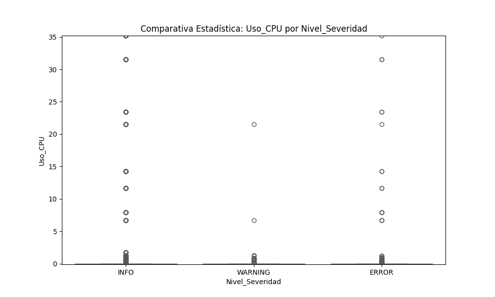

# 📊 Práctica 4: Pruebas Estadísticas

**Estudiante:** Diego Leonardo Alejo Cantú  
**Matrícula:** 2013810  
**Institución:** Facultad de Ciencias Físico Matemáticas (UANL)  

---

## 📋 Tabla de Contenidos

- [Objetivo](#-objetivo)
- [Requisitos Previos](#-requisitos-previos)
- [Estructura del Directorio](#-estructura-del-directorio)
- [Storytelling con Datos: Análisis del Comportamiento](#-storytelling-con-datos-análisis-del-comportamiento-del-sistema)
  - [1. El Hallazgo](#1-el-hallazgo-)
  - [2. La Evidencia Estadística](#2-la-evidencia-estadística-)
  - [3. Integración y Siguientes Pasos](#3-integración-y-siguientes-pasos-técnicas-avanzadas-)
- [Instrucciones de Ejecución](#-ejecución-del-script-estadístico)

## 🎯 Objetivo

Implementar un árbol de decisión estadístico en Python que evalúe los supuestos matemáticos (normalidad y homogeneidad de varianzas) para seleccionar y aplicar la prueba de hipótesis adecuada (ANOVA o Kruskal-Wallis), con el fin de determinar si el nivel de severidad de un log afecta significativamente el consumo de CPU.

## 🛠 Requisitos Previos

- **Python 3.x**
- Librerías: `pip install pandas seaborn matplotlib scipy numpy`
- El archivo CSV limpio generado en la Práctica 1.
- Variables de entorno configuradas (`DATASET` y `GRAFICA_ESTADISTICA`).

## 📖 Storytelling con Datos: Análisis del Comportamiento del Sistema

A partir de la extracción y análisis de la telemetría del sistema operativo (logs de `journalctl` en Ubuntu 24.04), hemos sometido nuestras variables a pruebas de rigor estadístico para comprender la naturaleza del consumo de hardware.

### 1. El Hallazgo 🔍

Contrario a la intuición técnica que sugiere que un error del sistema operativo demanda más capacidad de procesamiento para intentar resolverse o generar volcados de memoria, **descubrimos que los errores críticos no generan una sobrecarga en el procesador en comparación con los procesos rutinarios o informativos.** El nivel de criticidad de un evento en el sistema (`Nivel_Severidad`) es matemáticamente independiente de su consumo de hardware (`Uso_CPU`). Un error puede tumbar un servicio gastando 0% de CPU, mientras que un proceso rutinario puede consumir el 100% de manera normal.

### 2. La Evidencia Estadística 📈

Las afirmaciones anteriores no son suposiciones visuales, sino que están sustentadas por un riguroso árbol de decisión estadístico programado en Python (`scipy.stats`):

- **Descarte de Normalidad (Prueba Kolmogorov-Smirnov):** Se demostró con una confianza superior al 99.9% que los datos presentan una asimetría positiva extrema. Los p-valores para todas las severidades fueron cercanos a cero (ej. `[ERROR] p-valor: 4.0148e-122`). Esto invalidó el uso de pruebas paramétricas como ANOVA, justificando un enfoque no paramétrico.
- **Independencia de Variables (Prueba Kruskal-Wallis):** Al evaluar el impacto del Nivel de Severidad (INFO, WARNING, ERROR) sobre el Uso de CPU, la prueba arrojó un estadístico $H = 0.9963$ con un **p-valor de 0.607**.
- **Conclusión Matemática:** Al ser el p-valor ($0.607$) mucho mayor que el nivel de significancia ($\alpha = 0.05$), **no se rechaza la Hipótesis Nula ($H_0$)**. Se comprueba estadísticamente que no existe una diferencia significativa en el consumo de CPU entre los distintos niveles de alerta.



### 3. Integración y Siguientes Pasos (Técnicas Avanzadas) 🤖

El descubrimiento de que la severidad es independiente del consumo lineal de CPU cambia nuestra estrategia de modelado. Dado que la estadística clásica no puede separar los errores de la actividad normal basándose en el consumo, requerimos algoritmos capaces de encontrar relaciones multidimensionales no lineales.

Este hallazgo fundamenta directamente la aplicación de las siguientes técnicas avanzadas para las próximas etapas del proyecto:

1. **Clustering (K-Means / DBSCAN):** En lugar de agrupar por severidad etiquetada, aplicaremos aprendizaje no supervisado para descubrir si el sistema agrupa de forma natural "comportamientos anómalos" analizando en conjunto el CPU, la RAM y la longitud del mensaje.
2. **Clasificación (Random Forest):** Utilizaremos ensambles de árboles de decisión (que son inmunes a la falta de normalidad demostrada por la prueba KS) para predecir si un proceso anómalo fue ejecutado por el usuario `root` o por un usuario estándar, independientemente de la severidad del log.

---

## 📂 Estructura del Directorio

```text
.
├── Graficas_Estadisticas/
│   └── grafica_estadistica-UsoCPU-Nivel_Severidad.png
├── README.md
└── scripts/
    └── pruebas_estadisticas_journalctl.py
```

## 🚀 Ejecución del Script Estadístico

El script desarrollado evalúa automáticamente los supuestos matemáticos (Normalidad y Homogeneidad de varianzas) y decide algorítmicamente qué prueba ejecutar (ANOVA o Kruskal-Wallis).

```bash
# Exportar variables de entorno si es necesario
export DATASET="../Practica_1/csv/dataset_linux_journalctl_limpio.csv"
export GRAFICA_ESTADISTICA="./Graficas_Estadisticas"

# Ejecutar el árbol de decisión estadístico
python scripts/pruebas_estadisticas_journalctl.py
```

---
**Curso:** Minería de Datos\
**Autor:** Diego Leonardo Alejo Cantú\
**Matrícula:** 2013810
