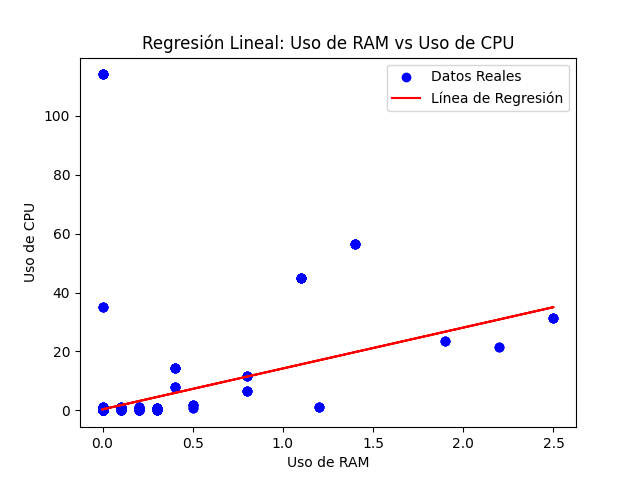

# 📊 Práctica 5: Modelos Lineales y Correlación

Esta práctica avanza hacia la fase de modelado predictivo utilizando los datos de telemetría de `journalctl` (Ubuntu 24.04). El objetivo es entrenar y evaluar un modelo de Regresión Lineal Simple para intentar predecir el consumo de CPU basándose en el consumo de RAM, y analizar rigurosamente su viabilidad.

## 📋 Tabla de Contenidos

- [Objetivo](#-objetivo)
- [Requisitos Previos](#-requisitos-previos)
- [Estructura del Proyecto](#-estructura-del-proyecto)
- [Storytelling con Datos: Evaluación del Modelo](#-storytelling-con-datos-evaluación-del-modelo)
  - [1. El Hallazgo](#1-el-hallazgo-)
  - [2. La Evidencia Estadística](#2-la-evidencia-estadística-)
  - [3. Integración y Siguientes Pasos (Técnicas Avanzadas) 🤖](#3-integración-y-siguientes-pasos-técnicas-avanzadas-)
- [Instrucciones de Ejecución 🚀💻](#instrucciones-de-ejecución-)

## 🎯 Objetivo

Generar un modelo lineal supervisado utilizando la librería `scikit-learn` para evaluar matemáticamente la relación de crecimiento proporcional entre los recursos del sistema, crear visualizaciones de la línea de tendencia y calcular las métricas de error (MSE) y determinación ($R^2$).

## 🛠 Requisitos Previos

- **Python 3.x**
- Entorno virtual activado con las librerías: `pip install pandas scikit-learn matplotlib`
- El archivo CSV limpio generado en la Práctica 1.
- Variable de entorno `DATASET` configurada apuntando a los datos.

## 📂 Estructura del Proyecto

```text
.
├── grafica/
│   └── regresion_lineal_journalctl.png
├── README.md
└── scripts/
    └── journalctl_modelo_lineal.py
```

## 📖 Storytelling con Datos: Evaluación del Modelo

### 1. El Hallazgo 🔍

Se comprobó que el consumo de recursos de hardware en este entorno Linux (CPU vs RAM) no sigue la regla de crecimiento proporcional. La interacción entre la memoria y el procesamiento es completamente asimétrica: un proceso puede saturar la RAM sin tocar la CPU y viceversa. El intento de encajar estos datos en un modelo de predicción de línea recta fracasó al no poder capturar los picos ni la naturaleza dispersa de los registros del sistema operativo.

### 2. La Evidencia Estadística 📈

Las afirmaciones anteriores se sustentan en el entrenamiento y evaluación del modelo de Regresión Lineal, el cual arrojó las siguientes métricas de rendimiento sobre el conjunto de prueba (`y_test`):

- **Coeficiente de Determinación ($R^2$):**
<span style="color:yellow ">**_0.1870_**</span> \
Esto demuestra matemáticamente que la línea de regresión solo es capaz de explicar el _18.7%_ del comportamiento del sistema, dejando un altísimo _81.3%_ de la varianza como "ruido" o comportamiento complejo sin explicación.

- **Error Cuadrático Medio (MSE):**
<span style="color:yellow ">**_64.56_**</span>\
Representa un margen de error demasiado alto e inaceptable para la precisión requerida al monitorear la telemetría y el rendimiento de un entorno Linux real.



### 3. Integración y Siguientes Pasos (Técnicas Avanzadas) 🤖

El pobre desempeño de la Regresión Lineal ($R^2 < 0.20$) y la línea de tendencia generada son la justificación metodológica final para **descartar los modelos paramétricos simples** en este proyecto.

Este proyecto confirman estadísticamente la necesidad de integrar técnicas de aprendizaje automático (Machine Learning) avanzadas en las siguientes fases. Aplicaremos algoritmos no lineales como **Árboles de Decisión (Clasificación)** o algoritmos de **Clustering**, los cuales están diseñados específicamente para encontrar patrones, reglas y agrupaciones en datos con alta precisión y asimetría como los que estoy usando.

## Instrucciones de Ejecución 🚀💻

El script entrena el modelo de `LinearRegression` dividiendo el dataset en un 80% para entrenamiento y 20% para pruebas (`train_test_split`).

```bash
# Exportar la variable de entorno con la ruta del dataset limpio
export DATASET="../Practica_1/csv/dataset_linux_journalctl_limpio.csv"

# Ejecutar el modelo lineal (Windows)
python scripts/journalctl_modelo_lineal.py

# Ejecutar el modelo lineal (MacOS/Linux)
python3 scripts/journalctl_modelo_lineal.py
```

**Curso:** Minería de Datos\
**Autor:** Diego Leonardo Alejo Cantú\
**Matrícula:** 2013810
